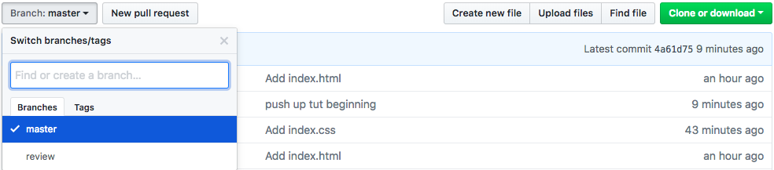
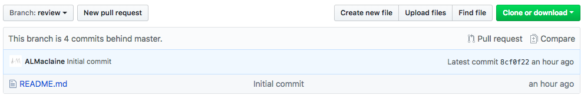
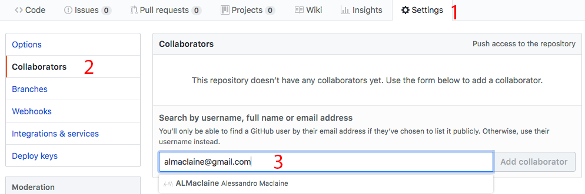
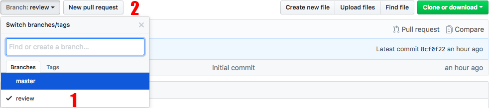
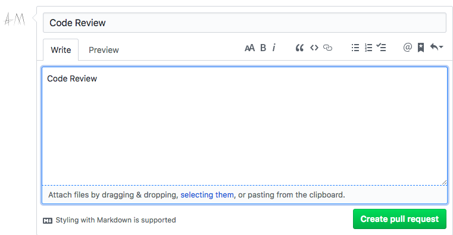

# code-review-old-project

Activity to teach how to create request a code review for an existing repo.

## Overview

This activity will teach you how to create a code review for the master branch from an existing repo.

## Steps

### Step 1 - View The Commit History

- Type the following command to see the complete commit history of the repo

```bash
git log
```

- To see oldest to nowest use the `--reverse` flag

```bash
git log --reverse
```

You shoul see something like the following:

```bash
commit 8cf0f22933906b72d4eb868f766249af408c6f7e
Author: Alessandro Maclaine <almaclaine@gmail.com>
Date:   Tue Jul 24 14:39:47 2018 -0700

    Initial commit

commit 13f863a2027ce4a654237c96a5eb617d8809470f
Author: ALM <ALM@dhcp-v073-143.mobile.uci.edu>
Date:   Tue Jul 24 14:45:13 2018 -0700

    Add index.html

commit a38b6fec05b044d11a5f43dd9cb525cf85e171c4
Author: ALM <ALM@dhcp-v073-143.mobile.uci.edu>
Date:   Tue Jul 24 14:47:52 2018 -0700

    Add index.css

commit 209bd1ebbd13775bd503d1d0be27485cf5ab9400 (HEAD -> master, origin/master, origin/HEAD)
Author: ALM <ALM@dhcp-v073-143.mobile.uci.edu>
Date:   Tue Jul 24 14:48:21 2018 -0700
```

- This is a listing of all the commits for the repo. Take note of the first commit sha hash, which for us is:
> 8cf0f22933906b72d4eb868f766249af408c6f7e

### Step 2 - Create a new based branch

- Using the commit sha # we can create a new branch based from that commit. That is, we will create a branch that was the same as the master branch when that commit was created (think of it as going back in time).

```bash
git branch branchname <sha1-of-commit>
```

- We will create a review branch from our initial commits hash

```bash
git branch review 8cf0f22933906b72d4eb868f766249af408c6f7e
```

- You can see the newly created branch by typing:

```bash
git branch --list
```

- You can enter the newly created branch by typing:

```bash
git checkout review
```

- You can view the files in the branch using ls

```bash
ls
```

- You should get back the following:

```bash
README.md
```

- This is what our repo looked like on initial commit so we've correctly created our branch.

### Step 3 - Push branch to github

- We need this branch on github so try pushing.

```bash
git push
```

You should see the following in your terminal:

```bash
fatal: The current branch review has no upstream branch.
To push the current branch and set the remote as upstream, use

    git push --set-upstream origin review
```

- Github doesn't know about this branch so we use the displayed command to push it up specifically.

```bash
git push --set-upstream origin review
```

- The branch should now be on github

### Step 4 - Check your branches on github

- You should now be able to see your branches on github.



- When you select review, your initial repo should come up.



### Step 5 - Add your TAs as collaborators

- After you've completed the above steps you must add your TA as a collaborator



1. Click On Settings
2. Click on collaborators
3. Type your TA's email and add them

### Step 6 - Make Pull Request from review to master

1. Change to dev branch in drop down.
2. Click new pull request



### Step 7 - Write Pull Request Message

1. Write 'Code Review' in Title and Description



### end